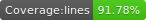

Grupo Zap Engineering Test
====================
   

An app using [React](https://pt-br.reactjs.org/), [Webpack](https://webpack.js.org/) for bundle and server, [Jest](https://jestjs.io/) and [React Testing Library](https://testing-library.com/docs/react-testing-library/intro) for testing, [Styled Components](https://www.styled-components.com/) for CSS in JS and [Eslint](https://eslint.org/) for linting.

# Install
Clone this repository and install it's dependencies with this command:
``` sh
npm install
```

# Running
Run webpack-dev-server with `npm start` command, it will start the app on [localhost:8080](http://localhost:8080):

``` sh
npm start
```

# Testing
Run the unit tests with this command:

``` sh
npm run test
```

# Linting 
Identify and report patterns found in ECMAScript/JavaScript code with this command:

``` sh
npm run lint
```

# Production build
Generate a build into `dist` folder with this command:

``` sh
npm run build
```
