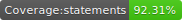
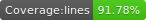
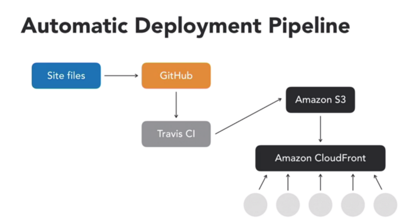

Grupo Zap Engineering Test
====================
  

An app using [React](https://pt-br.reactjs.org/), [Webpack](https://webpack.js.org/) for bundle and server, [Jest](https://jestjs.io/) and [React Testing Library](https://testing-library.com/docs/react-testing-library/intro) for testing, [Styled Components](https://www.styled-components.com/) for CSS in JS and [Eslint](https://eslint.org/) for linting.

# Install
Clone this repository and install it's dependencies with this command:
``` sh
npm install
```

# Running
Run webpack-dev-server with `npm start` command, it will start the app on [localhost:8080](http://localhost:8080):

``` sh
npm start
```

# Testing
Run the unit tests with this command:

``` sh
npm run test
```

# Linting 
Identify and report patterns found in ECMAScript/JavaScript code with this command:

``` sh
npm run lint
```

# Production build
Generate a build into `dist` folder with this command:

``` sh
npm run build
```

# Deploying

## First option
Build the `Dockerfile` with this command:

``` sh
docker build .
```

Generate a tag, push to your docker registry and run into your cluster or instance.

## Second option
Using [TravisCI](https://travis-ci.org/) you can create a pipeline from this repository to deploy into AWS S3 and invalidate a CloudFront cache after.



Just set this keys into your TravisCI pipeline: `AWS_ACCESS_ID`, `AWS_SECRET_ID` (you can get then from `IAM` service, give the `AmazonS3FullAccess` and `CloudFrontFullAccess` to the user), `S3_BUCKET` (bucket name) and `CF_ID`(your CloudFront id) and use this repository as the source. 
